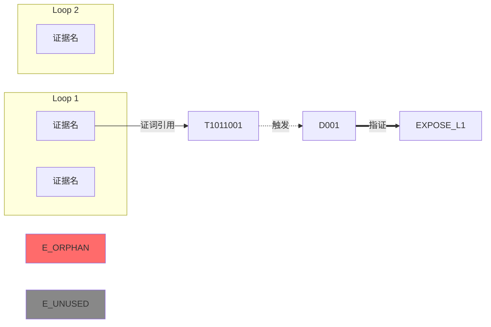
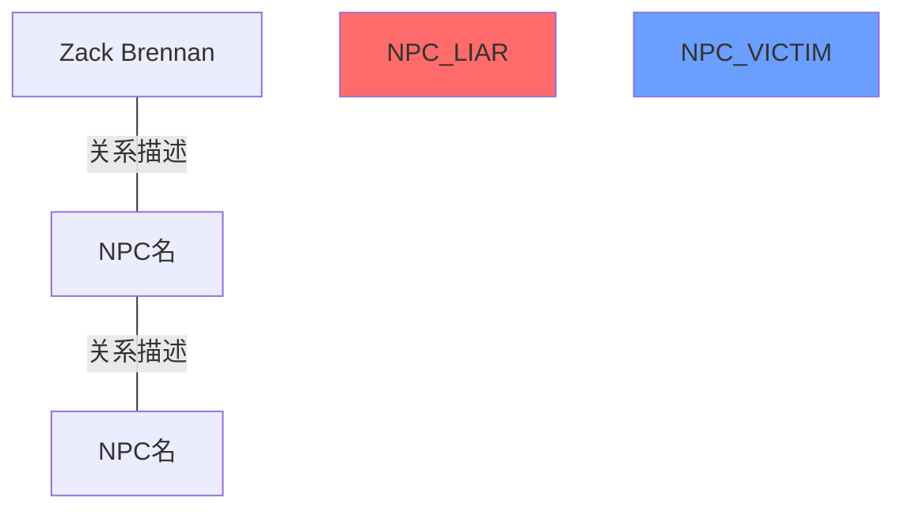

# Playthrough Audit — 全流程体验审计

AI 模拟玩家走完整个游戏流程，从 7 个维度深度审计，输出包含证据链路图、玩家风险点、问题明细的交互式 HTML 报告。

---

## 参数解析

收到用户调用后，首先解析审计范围：

| 输入格式 | 解析结果 |
|---------|---------|
| `Unit1` | EPI01, Loop 1-6 |
| `Unit2` | EPI02, Loop 1-6 |
| `Unit3` | EPI03, Loop 1-6 |
| `Unit1-Unit3` | EPI01-EPI03, 全部 Loop |
| `Unit2 L3-L5` | EPI02, Loop 3-5 |
| 无参数 | 默认审计全部已有内容 |

增量模式：如果参数包含 `--incremental`，在 Phase 1 检查上次审计时间戳，仅重新审计变更过的 Loop。

---

## Phase 1: 全量数据提取（orchestrator 自身执行）

**目标**：构建游戏全景数据包，后续所有 agent 不需要自己读原始文件。

### 1.1 读取配置表

按需读取以下文件（用 Read 工具）：

```
preview_new2/data/table/ItemStaticData.json      → 证据/道具
preview_new2/data/table/TestimonyItem.json        → 证词
preview_new2/data/table/Testimony.json            → 证词原文
preview_new2/data/table/DoubtConfig.json          → 疑点
preview_new2/data/table/ExposeData.json           → 指证数据
preview_new2/data/table/ExposeConfig.json         → 指证配置
preview_new2/data/table/NPCStaticData.json        → NPC 基础数据
preview_new2/data/table/SceneConfig.json          → 场景配置
preview_new2/data/table/Talk.json                 → 对话索引
preview_new2/data/table/GameFlowConfig.json       → 游戏流程
preview_new2/data/table/NPCLoopData.json          → NPC 循环数据
```

### 1.2 读取 State 文件

对审计范围内的每个 Unit，读取对应的 state 文件：

```
剧情设计/Unit{N}/state/loop{1-6}_state.yaml
```

如果 `AVG/对话配置工作及草稿/前置配置/` 下有同名 state 文件且更新时间更晚，优先使用。

### 1.3 扫描对话文件

扫描审计范围内的对话 JSON：

```
AVG/EPI{NN}/Talk/loop{N}/*.json       → Talk 对话
AVG/EPI{NN}/Expose/*.json             → Expose 对话
```

记录每个文件路径，不读取完整内容（留给 agent 按需读取）。

### 1.4 读取设计文档

```
剧情设计/Unit{N}/              → 章节设计文档
docs/游戏系统/核心玩法/         → 游戏系统规则
```

### 1.5 增量检测（如果 --incremental）

检查 `audit-reports/` 下是否存在该 Unit 的上次审计：
- 读取 `audit-reports/{Unit}_{date}/audit-meta.json`
- 对比各源文件的修改时间
- 标记哪些 Loop 需要重新审计
- 未变更的 Loop 直接复用上次审计结果

### 1.6 输出：游戏全景数据包

在内存中构建结构化数据（不落盘），格式如下：

```yaml
audit_scope:
  units: [Unit1]
  loops: [1, 2, 3, 4, 5, 6]
  incremental: false
  changed_loops: []  # 增量模式下填充

config_tables:
  items: {按 ID 索引的证据数据}
  testimonies: {按 ID 索引的证词数据}
  doubts: {按 ID 索引的疑点数据}
  exposes: {按 ID 索引的指证数据}
  npcs: {按 ID 索引的 NPC 数据}
  scenes: {按 ID 索引的场景数据}

per_loop:
  L1:
    state_summary: {从 state yaml 提取的关键信息}
    scenes: [场景列表 + NPC 分配]
    evidence_available: [本 Loop 可获取的证据 ID + 名称 + 描述摘要]
    testimonies_available: [证词 ID + 说话人 + 摘要]
    doubts_unlockable: [疑点 + 解锁条件]
    expose_target: {指证目标 NPC + 谎言层级 + 正确/陷阱证据}
    dialogue_files: [所有 Talk/Expose JSON 路径列表]
    known_facts_entering: [进入本 Loop 时玩家已知事实]
    known_facts_exiting: [离开本 Loop 时玩家应知事实]
    npc_knowledge: {每个 NPC 的 active_topics + blind_spots + withheld_topics}
  L2: ...
  ...

evidence_chain:
  # 证据全链路：证据 → 证词引用 → 疑点触发 → 指证使用
  - evidence_id: 1101
    name: "..."
    obtained_in: L1
    referenced_in_testimonies: [1011001, 1011002]
    triggers_doubts: [D001]
    used_in_expose: {loop: L1, round: 2, is_correct: true}
  - ...
```

用 AskUserQuestion 确认数据加载完成，展示：
- 审计范围：X 个 Unit，Y 个 Loop
- 数据量：Z 条证据、W 条证词、V 个指证
- 对话文件：N 个
- 预计耗时：~15 分钟

---

## Phase 2: 逐 Loop 审计 Brief 生成（orchestrator 自身执行）

**目标**：为每个 Loop 写一份自包含的 brief，让后续 agent 不需要读原始文件。

读取 brief 模板：`.claude/skills/playthrough-audit/references/brief-template.md`

为审计范围内的每个 Loop 生成一份 brief，写入临时工作目录：

```
audit-reports/{Unit}_{date}/briefs/L{N}_brief.md
```

每份 brief 包含（详见 brief-template.md）：
1. **玩家进入状态**：已知事实、已持有证据、已解锁疑点
2. **本 Loop 信息分配**：每个场景/NPC 承载的信息点
3. **对话摘要**：逐 NPC 的关键对话节点、证词获取点、分支结构
4. **指证设计**：目标、谎言层级、正确/陷阱证据
5. **前后衔接**：前序悬念、本 Loop 解答、新埋悬念
6. **对话文件路径**：供需要逐句审查的 agent 按需读取

**关键原则**：brief 必须包含足够信息让 agent 无需读 state/config 就能完成审计，但对话原文太长，只放摘要 + 路径。

**对话摘要必须读 JSON 验证**：state 文件对对话的功能标注可能与实际 JSON 内容不一致（例如 state 标注"开篇引导"但 JSON 实际是 post-expose 场景）。生成 brief 的§6 对话摘要时，必须读取每个对话 JSON 的前 5-10 条 `cnWords`，以 JSON 实际内容为准撰写摘要，不得照搬 state 文件描述。详见 brief-template.md 的"对话摘要验证规则"。

---

## Phase 3: 并行审计（7 个 agent 同时）

读取审计维度定义：`.claude/skills/playthrough-audit/references/audit-dimensions.md`

### 派发规则

**前置准备**：orchestrator 先读取以下游戏系统文档，提取关键规则摘要（不超过 500 字）注入每个 agent prompt：

```
docs/游戏系统/核心玩法/指证系统.md    → 指证流程、ExposeData 验证逻辑、谎言驱动原则
docs/游戏系统/核心玩法/对话与证词系统.md → 证词获取机制、对话脚本类型
docs/游戏系统/核心玩法/疑点系统.md     → 疑点解锁条件类型
docs/游戏系统/核心玩法/搜证与物品系统.md → 物品类型、分析/合成机制
docs/配置表详解.md                    → 各配置表字段定义（按维度提取相关段落）
```

同时 spawn 7 个 agent，每个用 `Agent` 工具并行调用。每个 agent 收到：
- **游戏系统规则摘要**（从上述文档提取，确保 agent 理解配置表字段含义和游戏机制）
- 全景数据包的相关子集（嵌入 prompt）
- 所有 Loop briefs 的路径
- 该维度的评分标准（从 audit-dimensions.md 提取）
- **事实核查要求**：所有 finding 必须标注数据来源（文件名+字段），不得凭推测下结论

### Agent 1: playthrough-sim（玩家流程模拟）

```
spawn agent: player-simulator
prompt 模板:

你正在执行全流程体验审计的"玩家流程模拟"维度。

## 任务
模拟一个普通玩家从 {第一个Loop} 到 {最后一个Loop} 的完整游戏体验。
你必须按 Loop 顺序走，严格遵守"此时此刻玩家知道什么"的限制。

## 数据
以下是每个 Loop 的审计 brief：
{briefs 路径列表，指示 agent 逐个读取}

## 输出要求
对每个 Loop 输出：

### Loop {N} 玩家体验记录

**信息获取时间线**：
- [时间点1] 场景A/NPC_X：获取了信息 xxx → 此时玩家可能推理出 yyy
- [时间点2] 搜证：获取证据 1101 → 此时玩家注意到 zzz
- ...

**推理路径评估**：
- 从"发现问题"到"找到答案"需要 N 步推理
- 每步是否有信息支撑：[逐步评估]
- 推理断层位置：[如有]

**"啊哈"时刻质量**：
- 时刻1：[描述] → 铺垫充分度 [1-5] / 惊喜感 [1-5]
- ...

**风险点**：
- [位置] [风险类型] [严重度 Critical/Major/Minor] [描述]

**难度评估**：
- 整体难度：[偏易/适中/偏难/过难]
- 信息密度：[前重后轻/均衡/前轻后重]

最后给出跨 Loop 的总体评估：
- 难度曲线是否合理递进
- 信息累积是否自然
- 玩家动力是否持续
```

### Agent 2: evidence-chain-audit（证据链路审计）

```
spawn agent: consistency-checker
prompt 模板:

你正在执行全流程体验审计的"证据链路"维度。

## 任务
追踪审计范围内每一条证据从 获取→引用→触发→使用 的完整生命周期。

## 数据
全景数据包中的 evidence_chain 数据：
{嵌入 evidence_chain 数据}

配置表数据：
{嵌入 items, testimonies, doubts, exposes 的相关子集}

briefs 路径：{列表}

## 输出要求

### 证据链路完整性

**完整链路**（正常）：
| 证据ID | 名称 | 获取Loop | 引用证词 | 触发疑点 | 指证使用 | 状态 |
|--------|------|---------|---------|---------|---------|------|

**断链/异常**：
| 证据ID | 名称 | 问题类型 | 问题描述 | 严重度 |
|--------|------|---------|---------|--------|
（问题类型：孤立证据/未引用证词/疑点条件缺失/指证未关联/跨Loop属性矛盾）

### 证据链路图数据（Mermaid 格式）

输出完整的 Mermaid flowchart 代码，要求：
- 每个证据是一个节点，按 Loop 分组
- 证词引用是箭头
- 疑点触发是虚线箭头
- 指证使用是粗箭头
- 断链节点标红
- 未使用证据标灰



### 证据使用效率
- 总证据数 / 被指证使用的证据数 / 使用率
- 陷阱证据的"看起来相关"说服力评分
```

### Agent 3: character-consistency（人物一致性审计）

```
spawn agent: narrative-designer
prompt 模板:

你正在执行全流程体验审计的"人物一致性"维度。

## 任务
审计所有 NPC 跨 Loop 的一致性：知识边界、说谎逻辑、性格语气、人物关系。

## 数据
NPC 设计文档路径：
- 剧情设计/00_世界观与角色/  （读取 NPC 人设）
- 各 Loop brief 中的 npc_knowledge 段

briefs 路径：{列表}

## 输出要求

### NPC 逐人审计

对每个 NPC：

**{NPC名} 跨 Loop 一致性**

| 维度 | L1 | L2 | L3 | L4 | L5 | L6 | 问题 |
|------|----|----|----|----|----|----|------|
| 知识边界 | ✓/✗ | ... |
| 说谎自洽 | ✓/✗ | ... |
| 性格语气 | ✓/✗ | ... |
| 态度转变合理性 | ✓/✗ | ... |

问题明细：
- [Loop] [问题类型] [严重度] [描述]

### 人物关系网络图（Mermaid 格式）



### 知识边界违规
| Loop | NPC | 泄露内容 | 应属 Loop | 严重度 |
|------|-----|---------|----------|--------|
```

### Agent 4: dialogue-sweep（对话全量扫描）

```
spawn agent: dialogue-reviewer
prompt 模板:

你正在执行全流程体验审计的"对话质量"维度。

## 任务
对审计范围内的所有对话执行 12 项审查清单扫描。
重点关注跨 Loop 的模式问题，而非单点问题。

## 数据
briefs 路径：{列表}
对话 JSON 路径：{按 Loop 分组的完整路径列表}

请逐个读取 brief，然后按需读取对话 JSON 文件进行逐句审查。

## 审查清单（12 项）
1. 知识边界  2. 信息分配  3. 证词覆盖  4. 物品描述准确性
5. 角色语气一致性  6. 对话链完整性  7. 证词获取节奏  8. ID编码正确性
9. 指证谎言机制  10.   11. 玩家视角测试  12. 平行场景隔离

## 输出要求

### 对话质量矩阵

| 维度 | L1 | L2 | L3 | L4 | L5 | L6 | 总评 |
|------|----|----|----|----|----|----|------|
| 1.知识边界 | PASS/FAIL/WARN | ... |
| 2.信息分配 | ... |
| ... |
| 12.平行场景隔离 | ... |

### 问题明细
| Loop | 维度# | 严重度 | 文件 | 位置 | 问题描述 | 修复建议 |
|------|-------|--------|------|------|---------|---------|

### 跨 Loop 模式问题
（不是某个 Loop 的单点问题，而是多个 Loop 重复出现的模式）
- [模式描述] [出现在哪些Loop] [根因分析] [修复方向]
```

### Agent 5: timeline-sweep（时序全量审计）

```
spawn agent: timeline-auditor
prompt 模板:

你正在执行全流程体验审计的"时序一致性"维度。

## 任务
全范围时序审计：信息泄露检测、known_facts 流转、证据属性跨 Loop 一致性。

## 数据
所有 Loop 的 state 文件路径：
{路径列表}

briefs 路径：{列表}

## 输出要求

### 信息泄露检测
| Loop | 泄露内容 | 出处(文件+位置) | 应属 Loop | 严重度 |
|------|---------|----------------|----------|--------|

### known_facts 流转验证
| 从 Loop | 到 Loop | 应传递的事实 | 实际状态 | 问题 |
|---------|---------|------------|---------|------|

### 证据属性跨 Loop 一致性
| 证据ID | 属性 | Loop X 描述 | Loop Y 描述 | 矛盾 |
|--------|------|-----------|-----------|------|

### 每 Loop 单层真相验证
| Loop | 应揭示的真相层 | 实际揭示 | 是否超标 | 问题 |
|------|--------------|---------|---------|------|

### 总结
[PASS / FAIL + 修复优先级]
```

### Agent 6: difficulty-curve（难度曲线分析）

```
spawn agent: player-advocate
prompt 模板:

你正在执行全流程体验审计的"难度曲线"维度。

## 任务
分析每个 Loop 的推理难度、信息密度、玩家认知负荷，绘制难度曲线。

## 数据
briefs 路径：{列表}

## 输出要求

### 逐 Loop 难度分析

| Loop | 推理步数 | 信息点数 | 核心谜题难度 | 指证难度 | 综合难度 | 评价 |
|------|---------|---------|------------|---------|---------|------|
| L1 | | | 1-5 | 1-5 | 1-5 | |
| ... |

### 难度曲线数据（供图表渲染）

```json
{
  "loops": ["L1", "L2", "L3", "L4", "L5", "L6"],
  "reasoning_steps": [2, 3, 4, 5, 4, 6],
  "info_density": [3, 4, 5, 4, 3, 5],
  "puzzle_difficulty": [2, 3, 4, 5, 4, 5],
  "expose_difficulty": [2, 3, 3, 5, 4, 5],
  "overall": [2, 3, 4, 5, 4, 5]
}
```

### 信息密度舒适区检查
- 每个场景/NPC 的核心信息点数（应 ≤3）
- 连续证据/证词获取间隔（应 ≥3-5 句对话）
- 每 Loop 总核心信息点（应 ≤8-10）
- 违规位置列表

### 挫败感风险点
| Loop | 位置 | 挫败类型 | 严重度 | 描述 | 建议 |
|------|------|---------|--------|------|------|
（类型：信息饥荒/信息过载/推理跳跃/碰运气/虚假选择/重复信息/无效探索）

### 推理断层检测
| Loop | 从(已知) | 到(需推出) | 缺失的中间步骤 | 严重度 |
|------|---------|-----------|--------------|--------|
```

### Agent 7: narrative-coherence（叙事连贯性审计）

```
spawn agent: narrative-designer
prompt 模板:

你正在执行全流程体验审计的"叙事连贯性"维度。

## 任务
审计跨 Loop 的叙事质量：情绪弧线、主题递进、伏笔回收、场景氛围。

## 数据
briefs 路径：{列表}
章节设计文档路径：{路径}

参考叙事节奏表：
| Loop | 真相层 | 情绪弧 | 全局节奏功能 |
|------|--------|--------|------------|
| L1 | 表面案件 | 困惑→发现 | 入口 |
| L2 | 权力介入 | 愤怒→无力 | 升级 |
| L3 | 深层网络 | 震惊→好奇 | 扩展 |
| L4 | 被迫的恶 | 同情→纠结 | 转折 |
| L5 | 爱与恨 | 心痛→理解 | 深化 |
| L6 | 真相的代价 | 释然→沉重 | 收束 |

## 输出要求

### 情绪弧线评估
| Loop | 设计情绪弧 | 实际对话传达的情绪 | 匹配度 | 问题 |
|------|-----------|-----------------|--------|------|

### 主题递进
- L1→L2 的认知升级是否自然？
- L4 的道德灰色地带是否成功建立？
- L5-L6 的情感收束是否有分量？

### 伏笔回收率
| 伏笔 | 埋设 Loop | 回收 Loop | 状态 | 回收质量 |
|------|----------|----------|------|---------|
（状态：已回收/未回收/部分回收）

### 场景氛围一致性
| 场景 | 设计氛围 | 实际传达 | 偏差 |
|------|---------|---------|------|

### 叙事风险点
| Loop | 位置 | 风险类型 | 严重度 | 描述 |
|------|------|---------|--------|------|
```

---

## Phase 3.5: 事实验证（orchestrator 自身执行）

**目标**：在交叉分析和 HTML 生成之前，验证 Phase 3 产出的所有 Critical/Major finding 的事实准确性，过滤掉因游戏机制误解导致的误报。

**为什么需要这一步**：Phase 3 的 agent 可能对配置表字段含义、指证验证逻辑、证据/证词区别等理解不准确，导致产出"看起来合理但事实错误"的 finding（如编造不存在的游戏概念、误判数据关系）。

### 执行步骤

1. **收集所有 Critical/Major finding**：从 7 份审计报告中提取
2. **逐条事实核查**：对每条 finding，查原始配置表 JSON 验证：
   - finding 引用的 ID 是否存在？字段值是否与 finding 描述一致？
   - finding 涉及的游戏机制是否正确理解？（对照 `docs/配置表详解.md` 和 `docs/游戏系统/核心玩法/` 下的系统文档）
   - "铺设/回收"类判断是否有具体文件+位置支撑？
   - 证据 vs 证词 vs 物品的区分是否正确？（ItemStaticData=物品，TestimonyItem=证词条目，Testimony=证词原文）
3. **标注验证结果**：
   - `[已验证]` — 查原始数据确认事实正确
   - `[已修正]` — 事实有误，附修正后的描述
   - `[已移除]` — 完全基于错误理解，不应出现在报告中
4. **输出验证后的 finding 列表**，仅保留 `[已验证]` 和 `[已修正]` 的条目传递给 Phase 4

### 常见误报模式（重点检查）

| 误报模式 | 检查方法 |
|---------|---------|
| 编造游戏概念（如"可选证据池"） | 对照指证系统.md 确认概念是否存在 |
| 混淆证据/证词/物品 | 检查 ID 格式（4位=物品，7位=证词）和所属配置表 |
| 虚报"铺设有效/无效" | 要求指明铺设的具体文件路径+行号 |
| ExposeData.item[] 中的 ID 类型误判 | item[] 可同时包含物品 ID 和证词 ID |
| 断言某 ID "未被引用" | 全文搜索该 ID 在所有配置表中的出现 |

---

## Phase 4: 交叉分析（1 个 agent）

等待 Phase 3 所有 7 个 agent 返回 + Phase 3.5 验证完成后执行。交叉分析 agent 收到的是**验证后的 finding 列表**，不是原始报告。

```
spawn agent: content-director
prompt 模板:

你是 NDC 项目内容总监，正在执行全流程审计的交叉分析阶段。

## 你收到了 7 份独立审计报告（已经过 Phase 3.5 事实验证）

1. 玩家流程模拟报告
2. 证据链路报告
3. 人物一致性报告
4. 对话质量报告
5. 时序审计报告
6. 难度曲线报告
7. 叙事连贯性报告

{嵌入 7 份报告全文}

## Phase 3.5 验证结果
{嵌入验证后的 finding 列表，含 [已验证]/[已修正] 标注}

**重要**：只使用 [已验证] 和 [已修正] 的 finding 进行交叉分析。被 [已移除] 的 finding 不应出现在最终报告中。

## 任务

### 1. 问题去重与归因
同一根因在多份报告中出现时，合并为一条。例如：
- 玩家模拟说"L3推理断层" + 证据链说"L3有证据未被对话引用" = 同一根因

### 2. 风险评级
对每个去重后的问题评定：
- **Critical**：影响核心推理体验，玩家可能卡关或体验崩溃
- **Major**：影响体验质量，但不致命
- **Minor**：体验微瑕，有时间就改
- **Suggestion**：优化建议，非问题

### 3. 修复优先级
按 Critical > Major > Minor > Suggestion 排序，同级内按：
- 影响范围（跨 Loop > 单 Loop）
- 修复难度（低 > 高）
- 玩家感知度（高 > 低）

### 4. 健康度评分
对每个维度打分（0-100）：
```json
{
  "player_experience": 85,
  "evidence_chain": 90,
  "character_consistency": 75,
  "dialogue_quality": 80,
  "timeline_consistency": 95,
  "difficulty_curve": 70,
  "narrative_coherence": 85,
  "overall": 83
}
```

### 输出格式

## 交叉分析报告

### 健康度评分
{JSON 格式}

### 统计摘要
- Critical: X 个
- Major: Y 个
- Minor: Z 个
- Suggestion: W 个

### 合并问题清单
| # | 问题标题 | 根因 | 影响Loop | 涉及维度 | 严重度 | 修复建议 | 修复难度 |
|---|---------|------|---------|---------|--------|---------|---------|

### 跨维度发现
（多个维度指向同一问题的交叉发现）

### 修复路线图
**第一优先级（本周）**：
1. ...

**第二优先级（下周）**：
1. ...

**第三优先级（有空就改）**：
1. ...
```

---

## Phase 5: HTML 报告生成（3 个 agent 并行）

### 5.0 准备工作（orchestrator）

1. 创建报告目录：`audit-reports/{Unit}_{YYYYMMDD}/`
2. 复制 reference 文件：
   ```bash
   cp .claude/skills/playthrough-audit/references/styles.css audit-reports/{dir}/
   cp .claude/skills/playthrough-audit/references/main.js audit-reports/{dir}/
   cp .claude/skills/playthrough-audit/references/_base.html audit-reports/{dir}/
   cp .claude/skills/playthrough-audit/references/_footer.html audit-reports/{dir}/
   cp .claude/skills/playthrough-audit/references/build.sh audit-reports/{dir}/
   mkdir audit-reports/{dir}/sections/
   ```
3. 定制 `_base.html`：替换 COURSE_TITLE 为审计标题，设置 amber 主题色，配置导航点

### 5.1 读取 section 模板

读取 `.claude/skills/playthrough-audit/references/section-templates.md`，了解每个 section 的 HTML 结构要求。

### 5.2 派发 3 个 agent 并行写 sections

**Agent A**（sections 01-04）：
```
spawn agent (general-purpose):
prompt:

你正在为 NDC 全流程审计报告生成 HTML sections。

## 你的任务
基于以下审计数据，生成 4 个 HTML section 文件。每个文件只包含 <section> 标签内容，不含 <html>/<head>/<body>。

## 可用 CSS classes
{从 section-templates.md 提取的 class 列表和用法说明}

## Section 01: executive-summary.html
- 健康度仪表盘（用 CSS 实现的环形进度条）
- 关键数字卡片（Critical/Major/Minor/Suggestion 计数）
- 审计范围信息
- 一句话总结

数据源：交叉分析报告中的健康度评分 + 统计摘要

## Section 02: evidence-chain.html
- Mermaid flowchart（嵌入证据链路图 Mermaid 代码）
- 断链/异常标注
- 证据使用效率统计

数据源：证据链路审计报告

## Section 03: player-journey.html
- 逐 Loop 时间线（步骤卡片）
- 风险点标注（红色标记）
- "啊哈"时刻标注（金色标记）
- 信息状态累积可视化

数据源：玩家流程模拟报告

## Section 04: character-network.html
- Mermaid 人物关系图
- NPC 逐人审计卡片（可展开）
- 知识边界违规表

数据源：人物一致性报告

写入路径：audit-reports/{dir}/sections/
```

**Agent B**（sections 05-07）：
```
spawn agent (general-purpose):
类似结构，负责：
05-difficulty-curve.html    → 难度曲线图（CSS/SVG实现）
06-dialogue-heatmap.html    → 对话质量热力图
07-timeline-audit.html      → 时序问题详表
```

**Agent C**（sections 08-10）：
```
spawn agent (general-purpose):
类似结构，负责：
08-narrative-assessment.html  → 叙事评估
09-issue-detail.html          → 完整问题明细（可筛选/排序）
10-fix-priorities.html        → 修复优先级路线图
```

---

## Phase 6: 组装与呈现

### 6.1 组装 HTML

```bash
cd audit-reports/{dir}
bash build.sh
```

### 6.2 保存审计元数据（供增量模式使用）

写入 `audit-reports/{dir}/audit-meta.json`：
```json
{
  "audit_date": "2026-04-02",
  "scope": "Unit1 L1-L6",
  "source_files_hash": {
    "loop1_state.yaml": "hash...",
    "loop2_state.yaml": "hash...",
    ...
  },
  "results_summary": {
    "critical": 3,
    "major": 7,
    "minor": 12,
    "suggestion": 5,
    "overall_score": 83
  }
}
```

### 6.3 呈现结果

用 AskUserQuestion 告知用户：
```
审计完成！

报告路径：audit-reports/{dir}/index.html
打开方式：在浏览器中打开上述文件

摘要：
- 整体健康度：83/100
- Critical 问题：3 个
- Major 问题：7 个
- 详细报告包含 10 个交互式 section，含证据链路图、难度曲线、对话质量热力图等

是否需要针对 Critical 问题立即启动修复？
```

---

## 注意事项

### 游戏知识注入（关键）
- Phase 3 每个 agent 必须收到游戏系统规则摘要，不能让 agent 猜测机制
- 至少包含：指证验证逻辑（ExposeData.testimony + item[] 精确匹配）、物品/证词/证词物品化的区别、疑点解锁条件类型、ID 编码规则
- agent 对不确定的机制应标注 `[待确认]` 而非自行推断

### Token 管理
- Phase 1 的数据提取要做摘要，不要把整个 JSON 塞进 agent prompt
- Brief 控制在每个 2000 字以内
- Phase 3 的 agent prompt 只嵌入该维度需要的数据子集 + 游戏系统规则摘要
- Phase 3.5 验证步骤由 orchestrator 直接执行，不额外消耗 agent token
- Phase 4 的交叉分析 agent 收到的是**验证后的** finding 列表，不是原始报告全文

### 错误处理
- 如果某个 agent 超时或失败，不要中断整个流程
- 在报告中标注"该维度审计未完成"
- 继续其他维度的审计和报告生成

### 增量模式
- 对未变更的 Loop，从上次报告中提取该 Loop 的审计结果
- 只重新运行变更 Loop 的审计
- 交叉分析必须用最新数据重新跑（因为可能有跨 Loop 影响）
- HTML 报告始终完整重新生成

### 与现有 agent 的关系
本 skill 复用以下现有 agent 定义（通过 prompt 给予审计模式上下文）：
- `player-simulator` → Phase 3 Agent 1
- `consistency-checker` → Phase 3 Agent 2
- `narrative-designer` → Phase 3 Agent 3 + Agent 7
- `dialogue-reviewer` → Phase 3 Agent 4
- `timeline-auditor` → Phase 3 Agent 5
- `player-advocate` → Phase 3 Agent 6
- `content-director` → Phase 4
