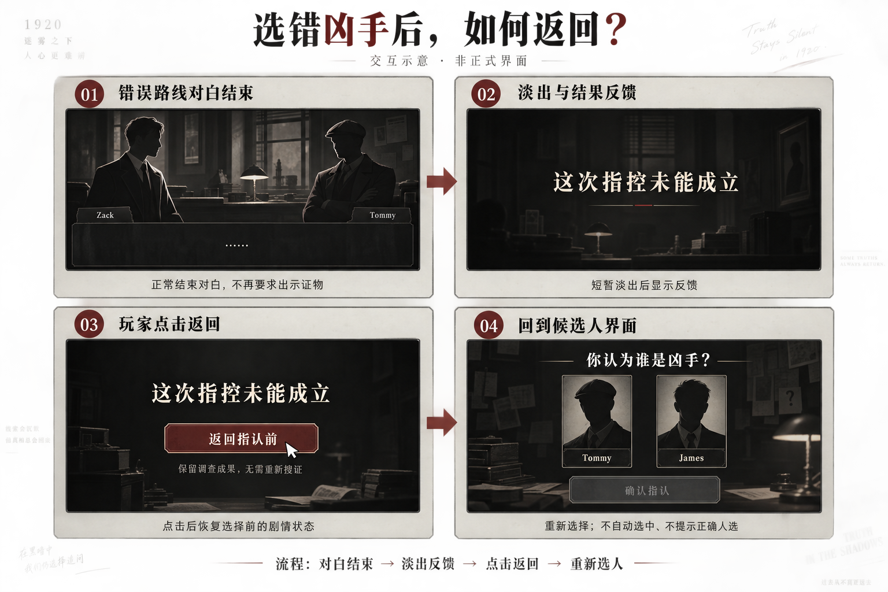

# 最终凶手选择｜通用玩法策划案

版本：v0.1，2026-09-18。状态：已确认方向的策划初稿，待逐章接入与运行验证。

适用范围：Unit1—Unit5 各章最后一轮。章节与循环数以根目录 `canon_manifest.json` 为准，“最后一轮”不统一写死为 L5。

## 1. 玩法目标与确认范围

玩家在调查、搜证和整理疑点的过程中形成判断，在章节最后一轮提交“谁是凶手”。选对后，进入正常证物指证：玩家逐轮出示材料、击破谎言，再接真相与尾声。选错后，进入同样的上下分屏界面，只推进对抗对白，逐渐发现指错了人，结束后返回选择。

本次已确认：

- 前面的搜证、证物分析和疑点玩法保留；最终对抗先选人，正确路线继续证物指证，错误路线只推进对白。
- 前面各轮沿用原有指证玩法，不随本功能整体改制。
- 各章采用同一套最终选择能力；候选名单、对抗内容和结束去向由章节定义。
- U1 首先落地：Tommy 为错误路线，James 为正确路线。
- U1 错误路线结束，淡出显示“这次指控未能成立”，出现“返回指认前”按钮，返回未选中的候选人界面；调查成果保留，剧情恢复选择前。
- 四分交互图已获用户认可。其中结果反馈与返回按钮是同一界面的两个呈现阶段，不是两次页面跳转。

正确路线沿用既定证据提交步骤；错误路线全程仅推进对白。本文不新增理由选择题、扣分、生命值或实时倒计时。未确定的交互细节在第 10 节单列，不冒充已批准规则。

## 2. 玩家流程

```text
完成本轮既定调查／疑点条件
  → 开放最终指认入口
  → 显示候选人（默认无选中）
  → 玩家选择一人，可在提交前更换
  → 点击“确认指认”
      ├─ 正确：对抗对白 → 玩家逐轮出示证物、击破谎言 → 真相还原／章节收束
      └─ 错误：对应错误路线对白
                 → 短暂淡出
                 → “这次指控未能成立”
                 → 同界面出现“返回指认前”
                 → 点击返回，恢复选择前状态
                 → 再次显示候选人（默认无选中）
```

“确认指认”先判断人物身份；选对后进入原有证词／道具指证判定，选错后进入纯对白路线。选中人物卡只改变选中态，不立即进入剧情。没有选中人物时不能提交；提交后只进入一条路线，连续点击不得重复启动。

U2—U5 采用最终选人模式，但具体错误剧情及返回安排须由各章接入方案明确；不因为 U1 有两名候选，就默认其他章节也是两人或有同样的错误结局。

## 3. 开放条件与推理公平性

沿用本章最后一轮已确认的主线调查／疑点完成条件，不以“改成选人”为由自动放宽前置，也不增加新的必收集物。

选人前必须已经存在足以支持判断的材料，不能用正确路线中才首次揭晓的供述反过来证明玩家此前应当知道答案。选人后的内容可以揭示犯罪经过和动机，但不能成为选择前缺失的唯一关键依据。

候选人使用相同层级的展示方式。初始、错误返回后均无预选，不通过卡片颜色、排序变化、勾叉、答案提示或自动聚焦暗示正确人物。人物名和头像用于识别，不展示自动归纳的定罪结论。

关键材料继续按现有疑点归属进入玩家调查路径。正确路线继续使用既定指证材料；后续对白引用的必要事实必须有可靠的前置来源。可选证物对应内容按玩家实际取得情况播放，不偷偷补发，也不让可选物成为隐含通关条件。

两名候选与无惩罚重试会使玩家在第一次失败后更容易猜中。接受这一体验代价，不通过临时增加候选、误导线索或惩罚弥补。设计目标是让第一次选择值得思考，错误路线有明确的叙事反馈。

## 4. 选择界面与错误反馈

### 对抗界面（2026-09-18 用户补充确认）

选对和选错都进入现有指证的上下分屏界面，沿用该界面的人物展示和对白推进交互。这里的“上下分屏”指界面布局。

错误路线也以正常对抗开场。随着嫌疑人回答、Zack追问和指控受阻，玩家逐渐发现指错了人；这段对白结束后才淡出并显示失败反馈。正确路线在同一类界面中保留逐轮选择与提交证物、击破谎言的交互，再进入真相与尾声。错误路线全程只推进对白。

四分示意图表达流程；其中对抗画面布局以本次明确的现有上下分屏界面为准。

| 元素／阶段 | 要求 |
|---|---|
| 选择标题 | “你认为谁是凶手？”；其他章节若指认对象含义不同，须由该章确认题面 |
| 候选卡 | 人物身份清楚、视觉权重一致；候选数由章节提供 |
| 选中态 | 明确显示玩家当前选了谁，可在提交前切换 |
| 提交按钮 | “确认指认”；未选中不可提交；点击后锁定本次提交 |
| 错误对白结束 | 正常结束对抗后短暂淡出，不弹出旧的“证据错误”提示 |
| 反馈标题 | “这次指控未能成立” |
| 返回按钮 | “返回指认前” |
| 辅助说明 | “保留调查成果，无需重新搜证” |
| 返回结果 | 回候选界面；无预选，不直接转去正确路线 |



图仅用于流程沟通。人物、背景和样式不代表正式美术定稿；不依据示意图新增角色外貌、场景或资产需求。淡出与按钮出现的具体时长由制作阶段调整，不作为计时玩法。

## 5. 选人后的对白职责

正确路线保留嫌疑人主动辩护、反驳、退守及情绪转折，也保留各轮证物选择、提交、错误重试和击破后的对白。错误路线以连续对白展现指控碰壁，全程没有选择、拖入或提交道具的操作。

Zack 可以引用玩家已有材料、指出矛盾；对白简洁，给玩家留出理解矛盾的空间。真相还原仍负责案件经过，对抗负责人物冲突，尾声负责后果与关系收束。

错误路线允许问出真实隐瞒，但必须让玩家理解：发现谎言或逼出坦白，不等于证明这个人是凶手。不能让嫌疑人无理由承认杀人，再由系统弹窗宣布答案错误。对话内应呈现指控无法推进的具体落点，之后才出现系统反馈。

本案只规定叙事职责，不写最终台词；正式对白按项目对白流程另行制作。

## 6. 返回、状态与存读档

“返回指认前”是明确的游戏流程回退，不是人物在同一时间线上保留错误路线坦白后继续审问下一人。玩家本人记得已看内容，但正确路线中的角色不能引用被回退的独占信息。

以本次提交前的调查状态建立返回基准。不能用“跳回某句对白”代替恢复；不要求程序采用某一种快照实现，但最终状态必须一致。

| 状态 | 返回时要求 |
|---|---|
| 物品、证词、分析状态、疑点及调查成果 | 恢复到本次指认前的状态，不丢失、不重复授予 |
| 错误路线新增的剧情标记／路线进度 | 撤销，不作为正确路线前置或已完成状态 |
| 场景、NPC、一次性演出及章节推进 | 恢复选择前应有状态，不能残留错误路线的场景或人物变化 |
| 当前选中候选人 | 清空 |
| 正确路线与章节完成状态 | 错误路线和返回操作均不得设置 |

U1 错误路线原则上不新增可带回的证物或证词，避免利用重试重复获物。若以后某章要求错误路线永久授予成果，属于新的设计选择，不能沿用本回退规则自动实现。

存读档的功能结果：

- 在已支持的保存点保存，重进后应恢复到该点对应的选人、路线对白、正确路线证物提交、失败反馈或正确尾声阶段。
- 错误路线或反馈页读档后，返回基准仍有效；不能丢失返回能力，也不能回到本轮开场。
- 返回失败或恢复尚未完成时，不允许提交下一人；重复点击返回只能完成一次恢复。
- 正确路线读档续播不能再把玩家送回错误反馈页；尾声、奖励和章节推进不能重复结算。
- 不要求增加手动保存入口或新的存档槽；具体保存时机与现有存档系统对齐。旧版六轮存档兼容另行核查，不承诺直接兼容。

## 7. 程序与配置交接范围

以下为功能需求，不是已经存在的正式字段或脚本枚举。字段名、存储位置由程序结合工程确定。

| 配置概念 | 用途 |
|---|---|
| 使用章节／循环与玩法模式 | 最后一轮启用选人，其余普通指证保持原行为 |
| 开放条件及入口 | 复用已确认的调查门槛，进入选择界面 |
| 候选列表与展示信息 | 不写死两名候选或某组 NPC ID |
| 每个候选对应路线入口及类型 | 正确候选进入既定证物指证；错误候选进入纯对白与返回流程 |
| 路线完成通知 | 错误对白结束显示返回反馈；正确路线完成全部指证后进入后续剧情 |
| 返回基准与恢复范围 | 支持本章确认的错误路线回退、保留调查结果 |
| 正确路线出口 | 接已有真相表现及尾声，最终按章节安排结束 |

可复用现有对白、切场、静态图／漫画／视频、章节收束能力。需新增／适配的是最终人物提交判定、路线分流、失败反馈与状态返回，以及对应的存读档接续。正确路线继续使用原指证判定；错误路线直接播放对白，脱离证物匹配等待。

地图／门解锁、分析证物兼容是另外的程序事项，不与本玩法捆绑为前提。

## 8. 章节接入

| 章节 | 采用方向 | 本文确认程度 |
|---|---|---|
| Unit1 / EPI01 | L5 最终选择 Tommy 或 James | 详见 [U1 接入方案](../../../U1优化制作/07_L5最终凶手选择玩法策划案.md) |
| Unit2 / EPI02 | 最后一轮采用选人 | 候选、判断材料、错误路线及结尾映射待专项接入 |
| Unit3 / EPI03 | 最后一轮采用选人 | 同上，不套用 U1 人物与两候选布局 |
| Unit4 / EPI04 | 最后一轮采用选人 | 固定终章与选人出口的关系待专项接入 |
| Unit5 / EPI05 | 最后一轮采用选人 | 具体指认问题、候选与责任归属须按本章剧情确认 |

## 9. 验收场景

1. 前置未完成不能提交；前置满足后正常开放，不要求新增的隐藏证物。
2. 无预选；切换卡片不启动对白；确认只启动对应路线一次。
3. 正确路线保留证物提交与选错证物重试；错误路线全程只推进对白。
   两类路线均进入现有指证上下分屏界面；错误路线在对白中逐渐呈现指控碰壁，结束后才显示结果反馈。
4. 第一次直接选对，也能理解完整对抗与尾声，不依赖错误路线坦白。
5. 选错后同一反馈界面显示标题及返回按钮；不自动跳回、不泄露正确人物。
6. 返回后的调查材料、分析状态、疑点与指认前一致；可再次选择，不要求重做探索。
7. 错误路线回退后，人物、场景和正确线分支不受错误线完成标记影响。
8. 反复选错、快速双击、退出重进，均不重复发物、不重复结算、不丢失返回点。
9. 已支持的存档阶段读档后，剧情与界面恢复一致。
10. 其他循环的旧指证玩法保持可用；不同章节的候选与返回状态互不串用。
11. 路线缺失或资源加载失败属于技术错误，不能显示“这次指控未能成立”冒充玩家选错；保留调查成果与返回基准，提供可恢复处理。

## 10. 初稿建议与待确定事项

- 建议提交前允许关闭选择界面，回案件板查看已有材料；不清调查成果。是否允许此时继续自由探索，留章节接入确认。
- 建议沿用“选中卡片＋确认指认”两步，不再增加二次确认弹窗；这是减少误触与操作长度的实现建议。
- 最终入口的中文名称、现有 EXPOSE 按钮如何切换表现，以及非中文文案待 UI 定稿。
- 原指证演出素材可以按语义复用；具体对白 ID、真相播放器衔接和存档兼容需工程接入核查。

## 11. 来源与版本边界

依据：2026-09-18 本次用户确认、根目录 Canon Manifest、现有指证／疑点／对话系统及 U1 五轮设计。旧系统文档中的历史章节例子不作为当前案件事实。

本文件确立新玩法目标，不宣称 State、对白或 Unity 已迁移。正确路线继续逐轮出示证物；错误路线原有的证物提交步骤属于本次待替换内容；落实范围按章节接入方案逐项同步，不能把新玩法说明当成已接入证明。
