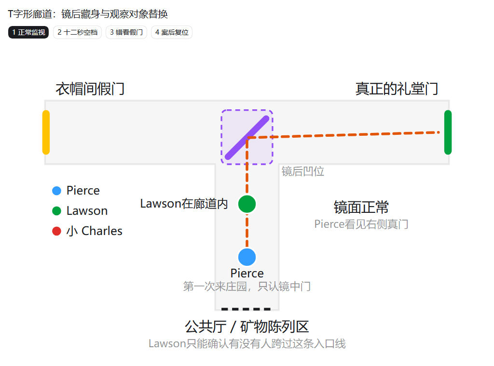
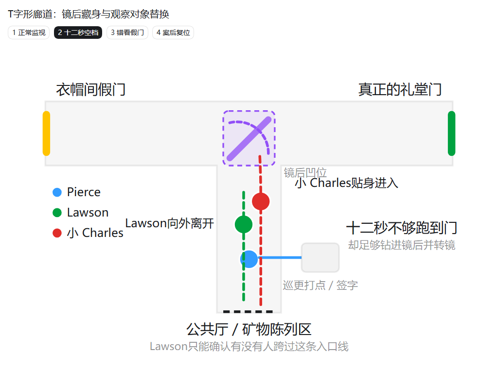
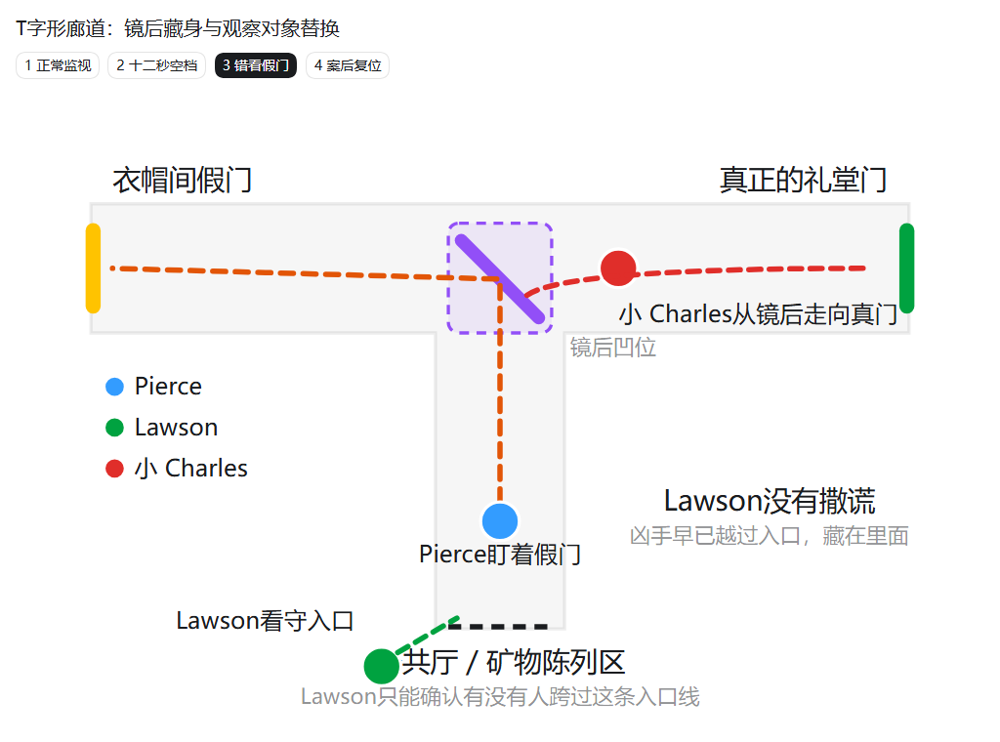
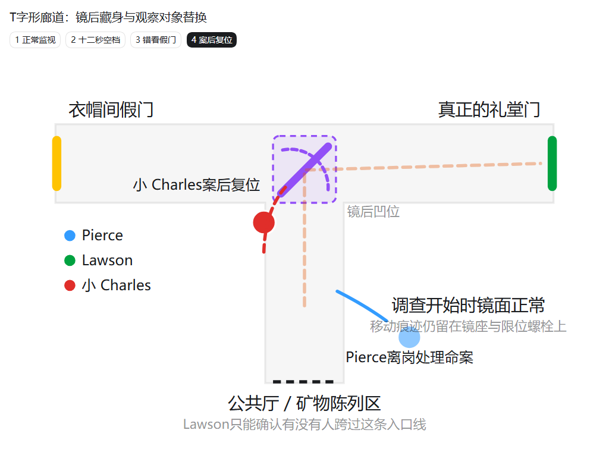

# Unit5 Loop 1 候选谜题：镜后藏身与被替换的观察对象

> 状态：独立设计稿，已完成核心逻辑确认；暂未并入 `Unit5_大纲_v2.md`，也不替换当前大纲中的 L1。
>
> 用途：后续重做 L1 Pierce 调查时，作为“唯一礼堂门看似始终有人监视”的完整谜题方案。
>
> 本稿不预填场景、证词、道具或指证 ID；所有时间为相对时序，合并大纲时再与案发分钟表统一。

---

## 一、一句话诡计

Pierce 只有在巡更打点签字时短暂移开过视线。这个空档短得不够凶手跑到礼堂门，却足够他借 Lawson 离开的身体遮挡钻进镜后凹位、转动镜子；此后 Pierce 始终盯着一扇紧闭的门，却已经不是礼堂门。

案件结束后，凶手趁警戒解除、众人被发现尸体的骚动吸引时把镜子复位，因此调查开始时，镜子看起来仍在正常角度。

核心不是“守卫离岗”，而是：

> 守卫没有漏掉观察；凶手替换了他观察的对象。

---

## 二、本方案替换什么、不改变什么

### 本方案准备替换的旧点

- 不再使用“Pierce 按指示避开侧廊”“临时锅炉事故”“补写一段不存在的侧廊巡查”作为 L1 核心谜题。
- 不再依赖凶手从无人看守的侧门直接进入。
- 礼堂对外只有一条正常进入廊道和一扇正常礼堂门；密室感来自“这扇门一直被看守”。

### 本方案不改变的既定动作

- 小 Charles 行凶后仍将旋转楼梯从 B 调回 A。
- 小 Charles 行凶后仍通过 A 位暗门与夹层离开礼堂。
- L1 只破解“有人怎样避开门口监视进入礼堂”，不破解凶手身份、刺杀过程或暗道离场方式。
- Moore、Vivian、小 Charles 等熟悉庄园的人在 L1 后仍保留嫌疑；不能因建筑知识直接锁定小 Charles。

---

## 三、空间结构

```text
公共厅／矿物陈列区
    │
    │  Lawson 离开后只能看见“有没有人跨过廊道入口”
    ▼
[廊道入口] ──短距离── [全身转轴镜＋镜后凹位] ────────── [真正的礼堂门]
                               ╲
                                ╲ 镜面稍微偏转后的视线
                                 ╲── [侧向衣帽间门／假门]

                 Pierce 固定观察位
                 他不能直视礼堂门，只能通过镜面观察
```

必须满足以下美术与空间条件：

1. 真礼堂门与衣帽间假门不在同一方向。假门位于侧向短厅或斜向支线，避免凶手经过真门时仍落在同一条直视线上。
2. 两扇门使用同一批深色木饰面与黄铜把手，从 Pierce 的远距离镜像中足够相似。
3. 两扇门仍保留一个可供玩家事后辨认的细微差别，例如：
   - 真门门槛有横向铜条，假门没有；
   - 假门下方有一道浅色补漆，真门没有；
   - 两扇门的铰链方向相反。
4. 镜子是庄园原有的全身转轴镜，不是现代监控设施。镜框安装在墙体加深的衣帽整理凹位前方，背后恰好容纳一人短暂藏身。
5. 镜子只需转动很小角度，远端反射目标便从真礼堂门切换到侧向假门；当前位置肉眼不易察觉。
6. 镜后凹位位于廊道入口的内侧。藏在里面的人已经越过 Lawson 能监视的公共入口，却还没有走向礼堂门。

---

## 四、人物位置与知识边界

### Pierce：第一次进入庄园的观察者

- 这是 Pierce 第一次在 Miller 庄园承担当夜警戒。
- 他不熟悉建筑，也不知道转轴镜偏转后还能照见另一扇外观相似的门。
- 庄园人员只告诉他：“坐在这个位置，从镜子里能看见礼堂门。”他据此把“镜中有一扇关着的门”等同于“礼堂门仍然安全”。
- 他唯一公开的视线中断，是按规定低头完成巡更打点和签字。时间很短，而且所有值守人员都知道。
- 他不是凶手的共犯，也没有故意放行。他的错误是过度相信一套自己并不了解的建筑观察方式。

### Lawson：最后一名公开经过廊道的人

- Lawson 因矿物陈列、借展清单或晚宴展品交接的正当事务进入廊道。
- 他离开廊道的时刻恰好与 Pierce 打点签字重合。
- 离开后，Lawson停留在公共厅的矿物陈列区；从那里可以看清有没有人从公共厅跨进廊道入口，却看不见转轴镜背后的内侧区域。
- 因此他的证词可以完全真实：

> “在我离开以后，没有第二个人从公共厅进入那条廊道。”

- 他不知道小 Charles紧贴在自己身后跨过入口，也没有看见对方随即侧身钻进镜后。

### 小 Charles：最熟悉完整空间的人

- 他从小生活在庄园，知道镜子可以转动、镜后能藏人，也知道偏转到哪个角度会把衣帽间假门送入 Pierce 的观察视线。
- 他知道 Pierce 当晚第一次来，不可能仅凭镜中远景分辨两扇相似的门。
- 他也知道巡更打点的固定动作和大致用时，因此不需要赌一个偶然的长时间离岗。
- 这些事实解释诡计为何合理，但 L1 不把它们组合成“只有小 Charles 能做到”的结论。

### Moore、Vivian等庄园常客：保留合理嫌疑

- Moore、Vivian等人经常出入庄园，对廊道、衣帽间和转轴镜并不陌生。
- 他们至少可能知道“镜子可以转”和“两扇门外观相似”，因此 L1 破解手法后，嫌疑不会立即集中到小 Charles。
- 小 Charles与他们的区别，是对镜后凹位、准确替换角度、案后离场机关的了解更完整；这些更深层知识留到后续 Loop 和宝石谜题证明。

---

## 五、案发前后的完整动作时序

以下用 `T` 表示 Pierce 开始低头打点的瞬间。具体分钟在并入大纲时再统一。

### 第一拍：建立一个看似无漏洞的观察系统

- Pierce坐在固定观察位，通过镜子看见真正的礼堂门。
- Lawson进入廊道处理矿物展品或借展清单事务。
- 小 Charles在公共厅附近等待。他不需要让 Pierce长时间离岗，只需要等Lawson返回与固定打点重合。

### 第二拍：唯一公开的十二秒

- `T+0`：巡更钟到点，Pierce转身或低头，在墙台上打点并签字。
- 这段动作建议固定为约十二秒。所有人都知道它存在，也都知道十二秒不足以从公共厅跑到礼堂门并开门消失。
- `T+1～T+3`：Lawson正从廊道向公共厅走出，身体和携带的文件夹短暂遮住入口附近其他人的视线。
- `T+2～T+5`：小 Charles贴在Lawson身后越过廊道入口，但不向礼堂门奔跑，只走到近处的转轴镜后。
- Lawson面朝公共厅离开，没有看见自己身后的人。
- `T+5～T+9`：小 Charles钻入镜后凹位，同时把镜面从真礼堂门转向侧向衣帽间假门。
- `T+12`：Pierce完成签字重新抬头。镜中仍是一扇紧闭的深色木门，因此他没有意识到观察目标已经被替换。

### 第三拍：两名证人的真话共同制造假结论

- Lawson留在公共厅矿物陈列区，可以确认此后没人从公共厅跨进廊道入口。
- Pierce继续盯着镜中假门，可以确认那扇门此后没有开启。
- 小 Charles从镜后凹位的内侧出来。他没有再次跨过廊道入口，因此不违反Lawson的证词。
- 他走向真正的礼堂门。Pierce此时观察的是假门，因此也看不到真门开启。

表面上，两名证人共同证明“再也没人进入礼堂”；实际上，他们各自只看守了半个命题：

- Lawson看守的是廊道入口，不是镜后内侧。
- Pierce看守的是一扇门，但不是礼堂门。

### 第四拍：行凶、离场与镜子复位

- 小 Charles从正常礼堂门进入，实施既定刺杀和现场布置。
- 他将旋转楼梯从 B 调回 A，再通过A位暗门与夹层离开礼堂。
- 他从夹层另一端回到庄园公共区域，因此无需从受监视的礼堂廊道原路返回。
- 案发后、尸体正式发现前后，警戒状态被打破：Pierce离开观察位处理敲门、失联或破门，Lawson也被骚动吸引。
- 小 Charles利用这段“警戒已经结束”的混乱，从镜框公共侧迅速把镜面恢复到原来的真门角度。
- 因此调查开始时，镜子看起来没有异常；Pierce也会更加确信自己当晚始终看着同一扇门。

注意：Pierce值守期间只有一次公开的视线中断。案后他离开观察位处理命案，属于值守已经被事件终止，不另算第二次巡逻空档。

### 四阶段静态示意图

#### 1. 正常监视



#### 2. 十二秒空档



#### 3. 错看假门



#### 4. 案后复位



---

## 六、玩家的错误认知与两次转弯

### 初始认知

玩家得到三个看似互相锁死的事实：

1. 礼堂只有一扇正常入口。
2. Pierce除打点签字的十二秒外始终看着礼堂门。
3. Lawson离开以后，没有任何人再进入礼堂廊道。

玩家自然会计算距离：十二秒不足以从廊道入口跑到礼堂门。因此这个唯一空档看起来没有意义。

### 第一次转弯：空档不是用来“进门”的

玩家在镜后发现当夜留下的藏身痕迹，并实测：

- 从入口到礼堂门需要远超十二秒；
- 从入口到镜后凹位只需数秒。

由此得出第一层答案：

> 凶手没有在十二秒内抵达礼堂门。他只在十二秒内让自己从观察系统中消失。

### 第二次转弯：被监视的对象发生了替换

玩家把Pierce对“镜中那扇门”的细节描述，与真礼堂门、衣帽间假门的特征进行比对，发现他描述的其实是假门。

镜座上“偏转后又回到原位”的擦痕进一步说明，调查时的正常角度不是案发时始终未动，而是有人事后复位。

由此得出第二层答案：

> Pierce确实一直看着一扇门；只是从打点结束以后，他看错了门。

### 最终重读Lawson证词

Lawson没有撒谎。凶手是在Lawson彻底离开以前，贴在他身后跨过入口并躲到镜后；Lawson开始观察入口时，凶手早已处于廊道内部。

因此：

> “之后没人进入”不等于“里面没有别人”。

---

## 七、建议的自由探索证据

### 1. Pierce巡更打点纸带与签字页

- 类型：Item · 文件。
- 作用：固定Pierce唯一公开的视线中断及其持续时间。
- 内容边界：只证明他低头约十二秒，不证明有人利用了这段时间。

### 2. Pierce的镜中门证词

- 类型：Testimony。
- 建议原文：

> “我签完字抬起头，那扇门还关着。门脚下面那块浅色补漆一直在镜子里，我不会认错。”

- 隐藏信息：浅色补漆属于衣帽间假门，不属于真正礼堂门。

### 3. Lawson的入口证词

- 类型：Testimony。
- 必须保留限定：

> “我离开后就在矿物陈列区核对清单。从那时到警戒被打断，没有第二个人从公共厅跨进礼堂廊道。”

- 不能摘要成“案发时没人进过廊道”，否则会丢失“我离开后”和“从公共厅跨入”两个关键限定。

### 4. 镜后凹位藏身痕迹

- 类型：Clue · 现场照片。
- 表现：清洁后重新积起的薄尘中，有鞋尖压痕、衣料擦过墙纸的短痕；痕迹只适合一人短时侧身藏匿。
- 作用：证明镜后当夜确实藏过人，不识别身份。

### 5. 入口—镜后—真门距离实测

- 类型：交互测距／计时玩法，完成后生成 Item · 派生。
- 输出：`十二秒镜后藏身复原页`。
- 分析输入：Pierce巡更打点纸带固定的十二秒、入口至两处目标的实测距离，以及玩家已经拍下的镜后当夜藏身痕迹。
- 结论：十二秒不足以抵达真门，却足以进入镜后凹位并转动镜框；镜后当夜又确实有人停留，因此不是单纯证明“理论上可能”。

### 6. 真门与假门的镜像差异

- 类型：两处Clue照片进行视觉比对，完成后生成 Item · 派生。
- 输出：`真假门镜像辨认页`。
- 结论：Pierce证词中的浅色补漆、门槛或铰链方向只属于衣帽间假门。

### 7. 镜座偏转与复位痕迹

- 类型：Clue · 现场照片；与镜框初始定位刻线进行视觉比对。
- 表现：底座薄尘存在两段新鲜弧形擦痕；限位螺栓先离开正常刻线，随后又压回原位。
- 输出：`镜像替换—案后复位复原页`。
- 结论：镜子当晚曾离开正常角度，后来又被恢复；不识别操作者。

---

## 八、建议的两轮指证结构

这两轮分别破解“凶手如何消失”与“Pierce究竟看着什么”。两轮证据维度分开，后一轮证据不能直接替代前一轮。

### R1：十二秒是否真的无法被利用？

Pierce主动坚持：

> “我只低头了十二秒。任何从公共厅进来的人，都不可能在我重新抬头前脱离视线。”

唯一最小答案：

- 证词：Pierce关于十二秒打点空档的证词。
- 道具：`十二秒镜后藏身复原页`。

击穿逻辑：Pierce把“来不及抵达礼堂门”等同于“来不及从视野中消失”；复原页证明凶手只需抵达近处镜后，十二秒完全足够。

本轮只承认：当时可能有人借Lawson离开的遮挡进入镜后，而且镜后确实留下当夜藏身痕迹。

本轮不揭示：Pierce后来为何仍没看见对方走向真门。

近似证据不能替代：

- `真假门镜像辨认页`只能证明门的视觉差异，不证明十二秒内有人能藏到哪里。
- 镜座复位痕迹只能证明镜子动过，不能证明凶手如何利用唯一空档越过入口。
- Lawson证词反而支持“此后没人进入”，不能单独回答凶手何时进入。

### R2：Pierce重新抬头后，看见的究竟是哪扇门？

Pierce在R1后主动退守：

> “就算有人躲进镜后也没有用。我抬起头以后始终看着礼堂门；他只要从镜后出来开门，我一定会看见。”

唯一最小答案：

- 证词：Pierce对镜中门细节的证词。
- 道具：`镜像替换—案后复位复原页`。

说明：`镜像替换—案后复位复原页`的分析输入包括`真假门镜像辨认页`与镜座偏转／复位痕迹；原始照片不进入Expose候选池，避免与派生结论形成多解。

击穿逻辑：Pierce描述的门脚补漆、门槛或铰链属于衣帽间假门；镜座痕迹又证明镜子曾偏向假门并在案后复位。Pierce的观察没有中断，但观察对象已经被替换。

本轮承认：Pierce第一次来到庄园，并不知道镜子还能照见侧向假门。他无法再保证自己当时监视的是真礼堂门。

本轮不揭示：谁转动镜子、谁进入礼堂、谁实施刺杀、凶手如何离开。

近似证据不能替代：

- `十二秒镜后藏身复原页`只证明有人能藏进去，不证明Pierce后来观察了错误的门。
- Lawson证词只看守公共入口，不能判断镜子内侧发生了什么。
- Moore、Vivian等人的庄园熟悉度只构成嫌疑，不是物理反证。

---

## 九、指证后的最小结论与嫌疑分布

### 玩家可以确定

1. Pierce的十二秒空档确实被利用，但不是用来直接跑到礼堂门。
2. 一名熟悉庄园结构的人借Lawson离开的遮挡进入镜后凹位。
3. 镜子随后被转向外观相似的假门，Pierce持续监视了错误目标。
4. 这名未知者从镜后进入内廊，并通过唯一正常礼堂门进入。
5. 案发后有人把镜子恢复原位，试图让监视记录重新变得可信。

### 玩家仍不能确定

1. 进入者是否就是刺杀者，也可能是同谋、整理现场者或事后包庇者。
2. 进入者如何离开反锁礼堂。
3. 小 Charles、Moore、Vivian等熟悉庄园的人，谁真正掌握并使用了这套空间条件。
4. 楼梯、A位暗门与宝石机关的关系。

### 嫌疑效果

- Pierce：从“故意制造空窗”降为“被陌生建筑欺骗、又过度确信自己观察无误”。他承担职业判断错误，但不成为合谋者。
- Lawson：成为一名说真话却制造错误密室印象的证人；他的证词必须保留时间与观察范围限定。
- 小 Charles：因最熟悉庄园而进入嫌疑池，但没有被唯一锁定。
- Moore、Vivian：因经常出入庄园、可能知道镜子与假门而继续保有合理嫌疑。

---

## 十、叙事高点对白骨架

> Pierce：“我只低头了十二秒。从入口到礼堂门，谁也来不及。”
>
> Zack：“的确来不及走到门。”
>
> Pierce：“那你还想证明什么？”
>
> Zack：“他根本没去门口。他只走到了镜子后面。”

第二轮：

> Pierce：“那又怎样？我抬头以后，门一直在镜子里。”
>
> Zack：“你看见门脚下那块浅色补漆了？”
>
> Pierce：“从我抬头到警戒结束，它一直在那里。”
>
> Zack：“真正的礼堂门，从来没有那块补漆。”
>
> Pierce：“……”
>
> Zack：“你没有漏看。有人让你看错了。”

最后由玩家自己补出结论，不让Zack继续说明凶手姓名：

> Lawson之后确实没见任何人进入；Pierce也确实始终看着一扇门。可凶手早已藏在观察范围里面，而那扇门也早已不再是礼堂门。

---

## 十一、合并大纲前必须锁定的参数

1. Pierce打点签字的准确持续时间，建议约十二秒。
2. 廊道入口到镜后凹位的距离，必须能在该时间内自然走到、藏入并偏转镜面。
3. 廊道入口到真正礼堂门的距离，必须明显超过十二秒，形成第一层“不可能”。
4. Lawson进入廊道的具体事务，以及他离开后在矿物陈列区停留的客观记录。
5. 真门与假门唯一、稳定且能从远距镜像辨认的视觉差异。
6. 镜子偏转、凶手藏身以及案后复位的美术结构图。
7. 小 Charles离开夹层、回到公共区域并趁警戒终止复位镜子的准确动作窗口。
8. 与后续L2楼梯复位、L3 Moore密道、L4药物和L5宝石谜题的揭示边界复核。
