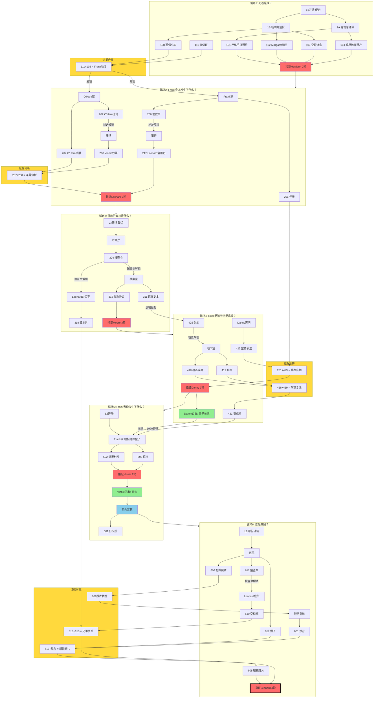

# Unit2 谜题依赖关系图 (Puzzle Dependency Diagram)

> **设计方法**: Ron Gilbert (Lucasfilm Games, Maniac Mansion)
> **生成日期**: 2025-12-25
> **最后更新**: 2025-12-25

---

## 循环核心任务总览

| 循环 | 核心任务 | 指证对象 | 轮次 |
|:---:|:---|:---:|:---:|
| L1 | 死者是谁？ | Morrison | 2轮 |
| L2 | Frank身上发生了什么？ | Leonard | 3轮 |
| L3 | 贷款的真相是什么？ | Moore | 3轮 |
| L4 | Rose是骗子还是真爱？ | Danny | 3轮 |
| L5 | Frank当晚发生了什么？ | Vinnie | 1轮 |
| L6 | 谁是真凶？ | Leonard | 4轮 |

---

## 图例说明

| 元素 | 含义 |
|:---:|:---|
| 红色节点 | 指证节点（含对象和轮次） |
| 绿色节点 | 自白/供出节点 |
| 蓝色节点 | 特殊场景（码头营救） |
| 黄色区块 | 证据合并/分析操作 |
| 实线箭头 | 依赖关系 |
| "硬切" | 剧情强制跳转 |
| "解锁" | 完成前置后开放 |

---

## 完整依赖关系图



---

## 关键依赖链总结

### 主线推进
```
L1 死者是谁？ → 指证Morrison(2轮) → 确认死者是Frank
    ↓
L2 Frank身上发生了什么？ → 指证Leonard(3轮) → 揭露银行-黑帮勾结
    ↓
L3 贷款的真相是什么？ → 指证Moore(3轮) → 揭露掠夺性贷款 + 获取遗嘱
    ↓
L4 Rose是骗子还是真爱？ → 指证Danny(3轮) → 证明Rose清白 + Danny自白位置
    ↓
L5 Frank当晚发生了什么？ → 开盒子获取遗书 → 指证Vinnie(1轮) → Vinnie供出码头 → 救Margaret
    ↓
L6 谁是真凶？ → 指证Leonard(4轮) → 诱导招供 → 揭露真凶
```

### L5流程详解（重要）
```
L4指证Danny → Danny自白(盒子位置) + 戒指421(1920密码)
    ↓
L5开场 → Frank家地板缝隙盒子 → 502举报材料 + 503遗书（情感高点）
    ↓
指证Vinnie(1轮) → Vinnie供出码头位置
    ↓
Mickey带领 → 码头营救Margaret → 501打火机
    ↓
L6开场硬切医院
```

### 场景解锁机制

| 循环 | 场景 | 解锁方式 |
|:---:|:---|:---|
| L1 | 鞋坊店铺+卧室 | 开场硬切 |
| L2 | Frank家+O'Hara家 | 111身份证+108小本子→地址 |
| L2 | 赌场 | O'Hara对话202 |
| L2 | 银行贵宾室 | 催款单206地址 |
| L3 | 市政厅 | 开场硬切 |
| L3 | 档案室+办公室 | 搜查令304 |
| L4 | 地下室 | 遗嘱311→钥匙425 |
| L5 | 地板缝隙盒子 | Danny自白(位置) + 戒指421(密码) |
| L5 | 码头 | Vinnie供出 |
| L6 | 医院 | 开场硬切 |
| L6 | 鞋坊(重访) | 606照片找茬玩法 |
| L6 | Leonard住所 | 搜查令612 |

### 跨循环证据合并

| 合并项 | 来源循环 | 结果 |
|:---|:---:|:---|
| 111身份证 + 108小本子 | L1 | Frank地址 → 解锁L2场景 |
| 207 O'Hara钞票 + 208 Vinnie钞票 | L2 | 连号分析 → 证明资金来源 |
| 201怀表 + 423空盒 | L2+L4 | Danny偷拿真相 |
| 418枯萎玫瑰 + 419水杯 | L4 | 鲜活玫瑰 → 银戒指(密码) |
| 318旧照片 + 610空相框 | L3+L6 | Leonard与Vinnie是兄弟 |
| 606照片 + 现场观察 | L6 | 找茬 → 发现烛台变化 |
| 617镊子 + 烛台下缝隙 | L6 | 眼镜碎片 |

---

## 设计要点

1. **线性但非单调**: 主线严格L1→L6，但每循环内有多条并行探索路径
2. **证据合并驱动**: 关键进展需要合并/分析证据，而非单纯收集
3. **跨循环伏笔**: L2怀表在L4才揭示真相，L3照片在L6才完成合并
4. **玩法多样化**: 包含对话解锁、物品解锁、密码解锁、找茬玩法等
5. **任务导向**: 每个循环有明确的核心疑问，引导玩家探索方向
6. **情感节奏**: L5开盒子获取遗书是Frank与Rose情感线的高点
